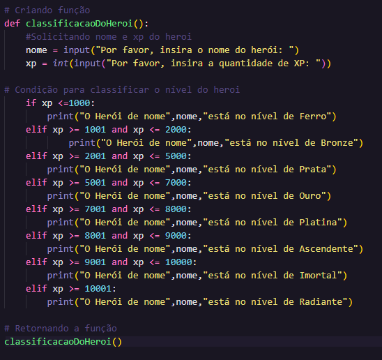

<!DOCTYPE html>
<html lang="en">
<head>
    <meta charset="UTF-8">
    <meta name="viewport" content="width=device-width, initial-scale=1.0">
</head>
<body>
  
<h1>1️⃣ Desafio Classificador de nível de Herói</h1>

<h3>Que deve ser utilizado:</h3> 
<ul>
    <li>Variáveis</li>
    <li>Operadores</li>
    <li>Laços de repetição</li>
    <li>Estruturas de decisões</li>
</ul>

<h3>Objetivo</h3>

Crie uma variável para armazenar o nome e a quantidade de experiência (XP) de um herói, depois utilize uma estrutura de decisão para apresentar alguma das mensagens abaixo:

<ol>
    <li>Se XP for menor do que 1.000 = Ferro</li>
    <li>Se XP for entre 1.001 e 2.000 = Bronze</li>
    <li>Se XP for entre 2.001 e 5.000 = Prata</li>
    <li>Se XP for entre 5.001 e 7.000 = Ouro</li>
    <li>Se XP for entre 7.001 e 8.000 = Platina</li>
    <li>Se XP for entre 8.001 e 9.000 = Ascendente</li>
    <li>Se XP for entre 9.001 e 10.000= Imortal</li>
    <li>Se XP for maior ou igual a 10.001 = Radiante</li>
</ol>

<h3>Saída</h3>

Ao final deve se exibir uma mensagem:

<i>"O Herói de nome **{nome}** está no nível de **{nivel}**"</i>
 
<h2>Código utilizado</h2>

O código foi pensando para ser executado de maneira mais simples possível. Para isso foi utilizado if e elif para criar as condições. Além disso, foi preciso criar uma função ClassificacaoDoHeroi e duas váriaveis que são: nome e xp do personagem.

<a href="Codigo.py">Link do código</a>

</body>
</html>

